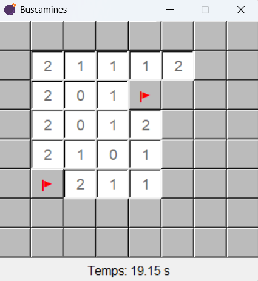

# 💣💣💣💣 Buscamines 💣💣💣💣

Aplicació gràfica interactiva desenvolupada amb Python i Tkinter que reimplementa el clàssic joc del **Buscamines**:
Has de descobrir totes les cel·les sense explotar cap de les mines.

Inclou registre de puntuacions mitjançant l'API de [SheetDB](https://sheetdb.io).

## 📦 Estructura del projecte

```
buscamines/
├── main.py              # Iniciador de l'aplicació
├── buscamines.py        # Lògica del joc
├── casella.py           # Classe Casella
├── config.py            # Configuració de l'aparença i el joc
└── api.py               # URL de l'API SheetDB
icon/
└── bomba.ico            # Icona per a l'executable
.gitignore
requirements.txt
exe-requirements.txt
```

## ▶️ Requisits

- Python 3.13+
- Dependències per **executar** el joc definides a `requirements.txt`
- Dependències per **crear executable** definides a `exe-requirements.txt`
- Connexió a internet per desar i recuperar puntuacions

## 🎮 Executar el joc

```bash
pip install -r requirements.txt
python main.py
```

## 🗃️ Crear executable

Un cop el joc és executable, pots crear un fitxer executable per a Windows utilitzant `pyinstaller`.

### 1. Instal·la les dependències

```bash
pip install -r exe-requirements.txt
```

### 2. Genera l'executable

Des de l'arrel del projecte introdueix:

```bash
pyinstaller --onefile --windowed --name=Buscamines --icon=icon/bomba.ico --add-data "icon/bomba.ico;icon" buscamines/main.py
```

L'executable es generarà a la carpeta `dist/`.

També pots descarregar la última versió des d'aquí:

[⬇️ Descarrega Buscamines](https://github.com/xbaubes/Buscamines/releases/download/v1.0/Buscamines.exe)

## 🕹️ Funcionalitats

- Disseny gràfic personalitzat amb emojis
- Marcatge de casella sospitosa de tenir una bomba amb clic dret
- Revelació automàtica de les caselles que no tenen bombes adjacents
- Control de temps i visualització del TOP 10 de puntuacions amb nom i temps
- Al finalitzar la partida se n'inicia automàticament una de nova

## ⏱️ API de puntuacions

Aquest projecte utilitza una API proporcionada per [SheetDB](https://sheetdb.io) per desar i obtenir els millors temps:

```python
https://sheetdb.io/api/v1/77zmp0nhr00bh
```

## 📸 Captura



## 🚧 TODO

🛠️ Estructura i codi

- **Separació MVC**: Actualment la lògica i la GUI estan entrellaçades. Reorganització modular separant clarament models, views i controllers. Això permetria reutilitzar la lògica per fer una versió web amb Flask

## 📝 Llicència

Aquest projecte està disponible sota la llicència MIT: Lliure d'ús, còpia i modificació amb crèdit a l'autor.
